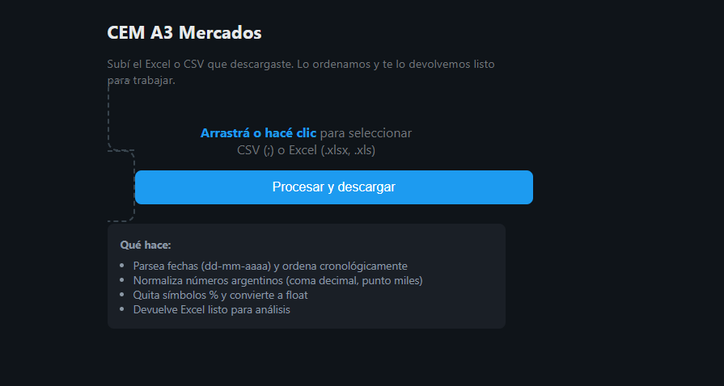
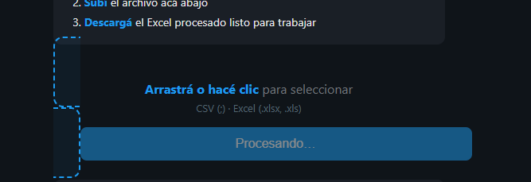

# 🗂️ Market Data ETL — CEM A3 Mercados

> Pipeline ETL para datos de mercado argentinos (ROFEX/BYMA). Incluye web app para subir Excel/CSV y descargar el archivo procesado.  
> Impulsado por [HedgeAR](https://hedgear.com/).

---

## Uso de la herramienta

**Origen de datos:** [CEM Matba Rofex](https://cem.matbarofex.com.ar/) — Centro Estadísticas de Mercado donde filtrás producto, rango de fechas y descargás CSV (Futuros u Opciones).

**Flujo:**

1. **Descargar** — En CEM elegís producto (ej. SOJ Dolar), posición, rango de fechas, y usás "Descargar CSV (Futuros)" o "Descargar CSV (Opciones)". El archivo viene con `;` como separador y formato argentino (coma decimal, punto miles, %).

2. **Subir** — Entrás a la [herramienta en Railway](https://clasificadora3cem.up.railway.app) (o localhost si corrés local) y subís el Excel o CSV descargado.

3. **Descargar** — La herramienta procesa y devuelve un Excel (nombre original + `_procesado.xlsx`) ordenado por fecha, con números normalizados y listo para análisis.

<p align="center">
  
</p>

<p align="center">
  <em>Interfaz de la herramienta — seleccionar archivo y procesar</em>
</p>

<p align="center">
  
</p>

<p align="center">
  <em>Estado durante el procesamiento</em>
</p>

---

## Web app (Railway)

### Qué hace

1. El usuario va a [A3 Mercados](https://www.a3mercados.com/) y descarga un Excel o CSV
2. Sube el archivo en la página
3. La app lo ordena, normaliza (coma decimal, punto miles, %) y devuelve un Excel listo para trabajar

### Desplegar en Railway

1. Subí este repo a GitHub (o conectá el repo existente)
2. En [Railway](https://railway.app/): **New Project** → **Deploy from GitHub** → elegí `clasificacion_datos_cem_A3`
3. Railway usa `nixpacks.toml` y el `Procfile` para el build
4. Generá un dominio público en **Settings** → **Networking** → **Generate Domain**

**Si falla el build:** En **Settings** → **Build** → **Root Directory**, fijate que no esté seteado (o que apunte a `.`). Los archivos `requirements.txt`, `Procfile` y `main.py` deben estar en la raíz del repo.

### Ejecutar en local

```bash
cd clasificacion_datos_cem_A3
pip install -r requirements.txt
python main.py
```

Abrí `http://localhost:5000`

---

## Script por línea de comandos

```bash
pip install pandas openpyxl
python sistema_de_clasficacion_de_datos.py
```

Input: `GAL.csv` (CSV separado por `;`, formato argentino)  
Output: `GAL.xlsx` (limpio, tipado, ordenado por fecha)

---

## Columnas

- `FECHA` → `datetime64` (orden ascendente)
- `PRODUCTO`, `TIPO CONTRATO` → strings
- Resto → `float64` (normalizado)

---

**Autor:** [Galo Szlomowicz](https://github.com/GaloSzlomowicz) · Impulsado por [HedgeAR](https://hedgear.com/) · [Repo](https://github.com/GaloSzlomowicz/clasificacion_datos_cem_A3)

## License
This project is licensed under the MIT License.
